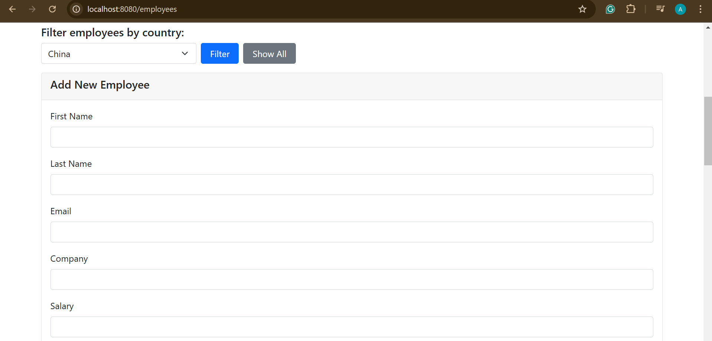

# 🎉 Employee Management System

A Spring Boot + Maven app to manage employee data with style! Features include CRUD operations, data import/export (CSV), and exporting images to a ZIP. Comes with both a REST API and a Thymeleaf-powered web interface.

---

## ✨ Features

- **CRUD Operations**: Add, view, update, delete employees.
- **Data Import/Export**: CSV upload and download.
- **Image Export**: Download employee images as a ZIP file.
- **REST API + MVC**: Use the API or the friendly web UI.

---

## 🛠️ Tech Stack

- **Java** + **Spring Boot**
- **Thymeleaf** (UI)
- **Maven** (Build)

---

## 📸 App Preview





## 🚀 Getting Started

1. Clone the repo:

   ```bash
   git clone https://github.com/cloudala/Employee-Management-App.git employees-app
   cd employees-app

   ```

2. Build it:

   ```bash
   mvn clean install

   ```

3. Run it:

   ```bash
   mvn spring-boot:run

   ```

4. Visit:

   - **Web**: `http://localhost:8080`
   - **API**: `http://localhost:8080/api`

5. Enjoy the app 😊!

---

## 🧪 REST Endpoints

- **List Employees**: `GET /api/employees`
- **Add Employee**: `POST /api/employees`
- **Update Employee**: `PUT /api/employees/{id}`
- **Delete Employee**: `DELETE /api/employees/{id}`

---
